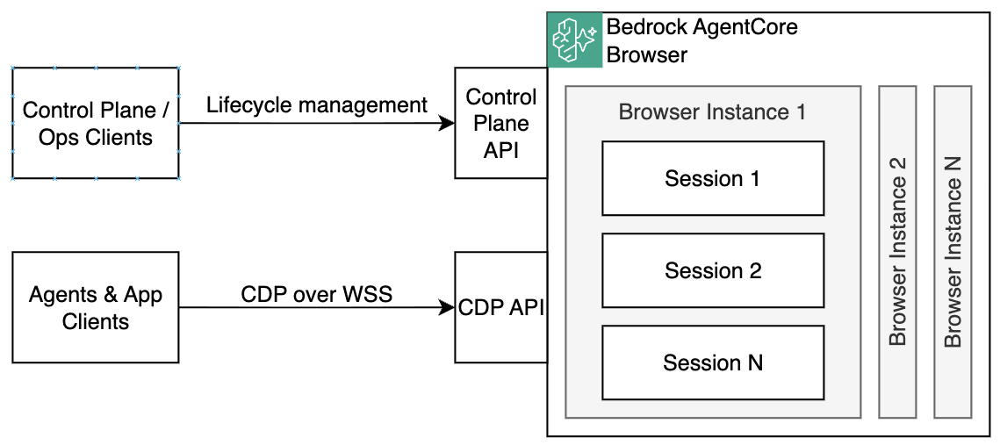

# Browser Basics

A demo for [Amazon Bedrock AgentCore Browser](https://docs.aws.amazon.com/bedrock-agentcore/latest/devguide/browser-managing-sessions.html) — a managed, remote browser sandbox you can automate using [CDP (Chrome DevTools Protocol)](https://chromedevtools.github.io/devtools-protocol/). This demo uses the [Playwright](https://playwright.dev/) framework that implements CDP client. 



## Prerequisites

- Python 3.13 && uv
- AWS CLI configured with appropriate credentials
- Terraform

## Project Structure

```
.
├── Makefile                          # Deploy, run demos, and teardown
├── src/
│   ├── demo1.py                      # Demo: navigate to a URL and capture a screenshot
│   └── pyproject.toml                # Python dependencies
└── terraform/
    ├── providers.tf                  # AWS provider, locals, and random prefix
    ├── browser.tf                    # Browser resource, IAM role, S3 recordings bucket
    ├── log-delivery-logs.tf          # (commented out) Application logs → CloudWatch
    ├── log-delivery-traces.tf        # (commented out) Traces → X-Ray
    └── log-delivery-usage-logs.tf    # (commented out) Usage logs → CloudWatch
```

## Setup

### 1. Deploy infrastructure

```bash
make deploy-infra
```

This provisions:
- IAM execution role trusted by `bedrock-agentcore.amazonaws.com` with S3 write permissions
- An AgentCore Browser instance with session recording enabled
- An S3 bucket for browser session recordings
- `tmp/browser_id.txt` — the Browser ID consumed by the demo

### 2. Run the demo

```bash
make run-demo1
```

`demo1.py` walks through the following steps:

1. Start a browser session on the provisioned AgentCore Browser
2. Connect Playwright to the remote browser via CDP over WebSocket (SigV4-signed)
3. Navigate to `https://aws.amazon.com`
4. Capture a JPEG screenshot via CDP
5. Save the screenshot to `tmp/screenshot.jpeg`
6. Stop the browser session

See example demo flow (some log lines are redacted for brevity):

```text
INFO:root:Starting the demo....
INFO:root:Creating new browser session in the browser_id=vfny_browser_basics-taXc0Tqm0w
INFO:root:Session created, session_id=01KNNFPP87YFA3B56T9REFGXPJ
INFO:root:Connecting a Playwright client to the session via ws_url=wss://bedrock-agentcore.us-east-1.amazonaws.com/browser-streams/vfny_browser_basics-taXc0Tqm0w/sessions/01KNNFPP87YFA3B56T9REFGXPJ/automation
INFO:root:Playwright client connected
INFO:root:Navigating to https://aws.amazon.com
INFO:root:Page opened. Title=Cloud Computing Services - Amazon Web Services (AWS)
INFO:root:Saving page screenshot...
INFO:root:Screenshot saved as ./tmp/screenshot.jpg...
INFO:root:All done!
```

Open `./tmp/screenshot.jpeg` to see the captured image.

## Teardown

```bash
make destroy
```

Destroys all AWS infrastructure and deletes the `tmp/` directory. The S3 recordings bucket is deleted even if it contains session recordings (`force_destroy = true`).
