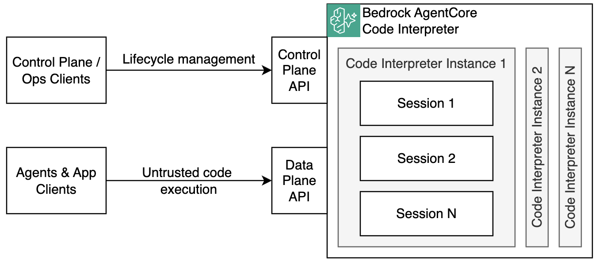

# Code Interpreter Basics

Interactive demos for [Amazon Bedrock AgentCore Code Interpreter](https://docs.aws.amazon.com/bedrock-agentcore/latest/APIReference/API_InvokeCodeInterpreter.html) — a managed, sandboxed execution environment to securely run untrusted code and shell commands on demand.



## Prerequisites

- Python 3.13 && uv
- AWS CLI configured with appropriate credentials
- Terraform

## Project Structure

```
.
├── Makefile                          # Deploy, run demos, and teardown
├── src/
│   ├── demo_execute_code.py          # Demo: execute Python code via Code Interpreter
│   ├── demo_execute_shell_command.py # Demo: execute shell commands via Code Interpreter
│   ├── code_to_execute.py            # Code to be executed inside of Code Interpreter Session
│   └── pyproject.toml                # Python dependencies
└── terraform/
    ├── providers.tf                  # AWS provider and locals
    ├── code-interpreter.tf           # Code Interpreter resource + IAM role
    ├── log-delivery-logs.tf          # Application logs → CloudWatch
    ├── log-delivery-traces.tf        # Traces → X-Ray
    └── log-delivery-usage-logs.tf    # Usage logs → CloudWatch
```

## Setup

### 1. Deploy infrastructure

```bash
make deploy-infra
```

This provisions:
- IAM execution role trusted by `bedrock-agentcore.amazonaws.com`
- A Bedrock AgentCore Code Interpreter instance
- CloudWatch log groups for application logs and usage logs (7-day retention)
- X-Ray tracing delivery
- `tmp/code_interpreter_id.txt` — the Code Interpreter ID consumed by the demos

### 2. Install Python dependencies

```bash
cd src && uv sync
```

### 3. Run the Demos

Both demos walk through the same lifecycle step-by-step, pausing at each stage for you to press ENTER:

1. Create a Code Interpreter session
2. Invoke the interpreter (code or shell command)
3. Stream and print the result
4. Terminate the session

### Execute Python code

Executes the contents of `src/code_to_execute.py` inside the sandboxed interpreter.

```bash
make run-execute-code-demo
```

Result:
```text
...REDACTED...

INFO:root:CODE_TO_EXECUTE=
-----START-----
print("AgentCore Code Interpreter Demo Start!")
a = 1
b = 2
print(f'The sum of a={a} and b={b} is {a+b}')
print("AgentCore Code Interpreter Demo End!")
----- END -----

...REDACTED...

INFO:root:> Invocation result:
INFO:root:AgentCore Code Interpreter Demo Start!
The sum of a=1 and b=2 is 3
AgentCore Code Interpreter Demo End!

...REDACTED...
```

### Execute a shell command

Executes `pwd && ls -la && uname -a` inside the sandboxed environment.

```bash
make run-execute-shell-command-demo
```

```text
...REDACTED...

INFO:root:COMMAND_TO_EXECUTE=pwd && ls -la && uname -a

...REDACTED...

INFO:root:> Invocation result:
INFO:root:/opt/amazon/genesis1p-tools/var
total 51
drwxrwxr-x  1 genesis1ptools genesis1ptools  4096 Mar 17 05:41 .
drwxr-xr-x  1 root           root            4096 Mar 17 05:29 ..
drwxr-xr-x  3 genesis1ptools genesis1ptools  4096 Mar 17 05:41 .ipython
drwxrwxr-x  2 genesis1ptools genesis1ptools     3 Mar 16 18:02 log
drwxr-xr-x 50 genesis1ptools genesis1ptools  1081 Mar 17 05:29 node_modules
drwxrwxr-x  1 genesis1ptools genesis1ptools  4096 Mar 17 05:41 nodejs-js-execution
drwxrwxr-x  1 genesis1ptools genesis1ptools  4096 Mar 17 05:41 nodejs-ts-execution
-rw-r--r--  1 genesis1ptools genesis1ptools 22351 Mar 17 05:29 package-lock.json
-rw-r--r--  1 genesis1ptools genesis1ptools   146 Mar 17 05:29 package.json
drwxr-xr-x  2 genesis1ptools genesis1ptools     3 Mar 17 05:18 run
Linux localhost 6.1.158-15.288.amzn2023.aarch64 #1 SMP Fri Nov  7 16:42:13 UTC 2025 aarch64 aarch64 aarch64 GNU/Linux

...REDACTED...

```
## Teardown

```bash
make destroy
```
