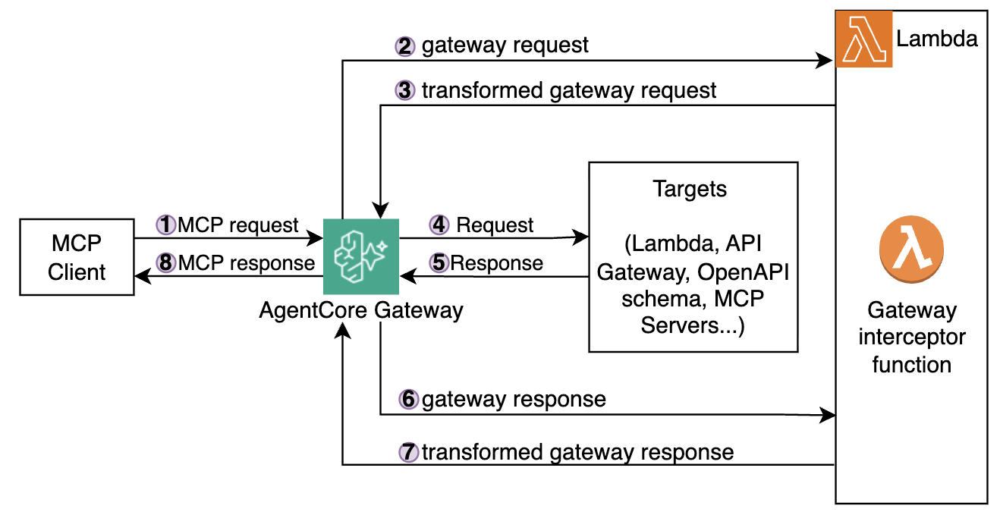

# AgentCore Gateway with Interceptors

A sample project demonstrating how to configure **Lambda interceptors** on an Amazon Bedrock AgentCore Gateway. Interceptors let you inspect and transform both inbound requests and outbound responses as they flow through the gateway. The same pizza-ordering Lambda tools from the gateway-basics sample are reused here; the focus is on the interceptor plumbing. Everything is provisioned via Terraform.

Other AgentCore Gateway projects:

- [Gateway Basics](https://github.com/aal80/agentcore-samples/tree/main/gateway-basics)
- [Gateway with inbound JWT](https://github.com/aal80/agentcore-samples/tree/main/gateway-with-inbound-jwt)
- [Gateway with AgentCore Policy](https://github.com/aal80/agentcore-samples/tree/main/gateway-with-policies)
- [Gateway with Open Policy Agent](https://github.com/aal80/agentcore-samples/tree/main/gateway-with-open-policy-agent)

## Architecture



The project deploys:

- **AgentCore Gateway** — an MCP-compatible gateway with a Lambda interceptor attached to both `REQUEST` and `RESPONSE` interception points, with `pass_request_headers` enabled
- **gateway-interceptor** — Lambda function (Node.js 22) invoked by the gateway on every request and response; two handler variants are included:
  - `index1.js` — pass-through interceptor that logs and forwards requests/responses unchanged
  - `index2.js` — mutating interceptor that modifies request arguments (swaps `itemIds`) and enriches responses (adds `currency` field)
- **get-menu** — Lambda function (Node.js 22) that returns a pizza menu
- **create-order** — Lambda function (Node.js 22) that accepts pizza IDs and creates an order

## How Interceptors Work

When the gateway receives a request, the interceptor Lambda is called:

1. **Request interception** — the interceptor Lambda receives the parsed MCP request body (and optionally headers). It must return a `transformedGatewayRequest` containing the (possibly modified) request body that will be forwarded to the Gateway target.
2. **Response interception** — after the target responds, the interceptor Lambda receives both the original request and the gateway response. It must return a `transformedGatewayResponse` with the status code and body to send back to the caller.

The `sample-interceptor-payloads/` directory contains example input/output JSON for both interception points.

### Switching Interceptor Handlers

The Terraform config (`lambda-gateway-interceptor.tf`) sets the handler to `index1.handler` (pass-through) by default. To use the mutating interceptor, change the handler to `index2.handler` and redeploy.

## Project Structure

```
gateway-with-interceptors/
├── lambda/
│   ├── get_menu/index.js              # Returns pizza menu
│   ├── create_order/index.js          # Creates an order from pizza IDs
│   └── gateway_interceptor/
│       ├── index1.js                  # Pass-through interceptor (default)
│       └── index2.js                  # Mutating interceptor (modifies args & response)
├── sample-interceptor-payloads/
│   ├── request-interceptor-input.json   # Sample event the interceptor receives on REQUEST
│   ├── request-interceptor-output.json  # Expected return shape for REQUEST interception
│   ├── response-interceptor-input.json  # Sample event the interceptor receives on RESPONSE
│   └── response-interceptor-output.json # Expected return shape for RESPONSE interception
├── terraform/
│   ├── providers.tf                   # AWS provider and naming config
│   ├── gateway.tf                     # Gateway, interceptor config, IAM role, and tool targets
│   ├── lambda-get-menu.tf            # get-menu Lambda function
│   ├── lambda-create-order.tf        # create-order Lambda function
│   └── lambda-gateway-interceptor.tf # Interceptor Lambda function
├── Makefile                           # Deploy and test commands
└── README.md
```

## Prerequisites

- AWS CLI configured with appropriate credentials
- Terraform >= 1.0
- `curl` for testing

## Deploy

```bash
make deploy-all
```

This runs `terraform init` and `terraform apply` to provision all resources.

## Test

### 1. List available MCP tools

```bash
make list-tools
```

### 2. Get the pizza menu

```bash
make get-menu
```

### 3. Create an order

```bash
make create-order
```

Explore interceptor Lambda logs in `/aws/lambda/{SOME_ID}-gateway-with-interceptors-gateway-interceptor` CloudWatch log group. You will see both requests and responses intercepted and logged. No payload modifications are occuring at this point. 

Note that create order sends `itemIds=[1,2,3]` and create order output currently does not contain currency. 
Note that Pizzas with IDs=[1,2,3] are Margherita, Pepperoni, Four Cheese. 

```json
Request: 
{
   "jsonrpc":"2.0",
   "id":1,
   "method":"tools/call",
   "params":{
      "name":"create-order___create-order",
      "arguments":{
         "itemIds":[
            1,
            2,
            3
         ]
      }
   }
}

Response: 
{
   "jsonrpc":"2.0",
   "id":1,
   "result":{
      "isError":false,
      "content":[
         {
            "type":"text",
            "text":"{\"date\":\"2026-03-24T23:26:30.676Z\",\"items\":\"Margherita, Pepperoni, Four Cheese\",\"total\":43.97}"
         }
      ]
   }
}
```

### 4. Update deployment to use mutating interceptor

* Edit `./terraform/lambda-gateway-interceptor.tf`. 
* In `aws_lambda_function.gateway_interceptor` resource change handler to `index2.handler`. 
* Explore `./lambda/gateway_interceptor/index1.js` and `./lambda/gateway_interceptor/index2.js`, see how request and responses are intercepted and modified
* See `./sample-interceptor-payloads` for sample input/output to both request and response interceptors. 
* Redeploy the updated sample with `make deploy-all`

### 5. Create new orders

```bash
make create-order
```

Note that CURL still sends `itemIds=[1,2,3]` when calling the MCP tool. However
1. Request interceptor is changing that to `itemIds=[4,5,6]`. As a result you see different pizzas in your order (BBQ Chicken, Hawaiian, Veggie Supreme). 
2. Response interceptor is adding `currency=USD` to MCP response. 

```json
Request: 
{
   "jsonrpc":"2.0",
   "id":1,
   "method":"tools/call",
   "params":{
      "name":"create-order___create-order",
      "arguments":{
         "itemIds":[
            1,
            2,
            3
         ]
      }
   }
}

Response: 
{
   "jsonrpc":"2.0",
   "id":1,
   "result":{
      "isError":false,
      "content":[
         {
            "type":"text",
            "text":"{\"date\":\"2026-03-24T23:33:49.097Z\",\"items\":\"BBQ Chicken, Hawaiian, Veggie Supreme\",\"total\":47.47,\"currency\":\"USD\"}"
         }
      ]
   }
}

```

## Cleanup

```bash
make destroy
```
