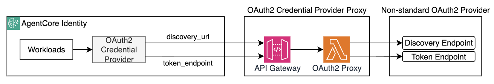
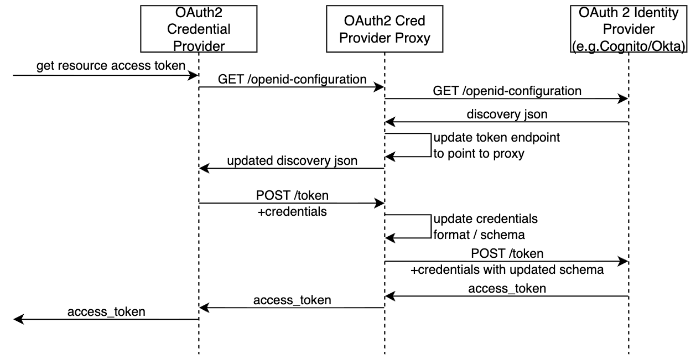

# WORK IN PROGRESS!!!!

# Gateway with OAuth2 Credential Provider Proxy

A sample project showing how to front an identity provider (Cognito in this case, but can be anything else) with a proxy wired to a `CustomOauth2` AgentCore Identity Credential Provider. This pattern can be useful in case you want to use an identity provider which is not fully OAuth2/OIDC compliant and requires `/token` request customizations. 



## The Workflow



The proxy exposes two OAuth2 endpoints an AgentCore Credential Provider needs:

- `GET /.well-known/openid-configuration` — OIDC discovery. Fetches the upstream discovery document and rewrites the `token_endpoint` to point back at this proxy.

- `POST /oauth2/token` — Token endpoint. Extracts `client_id` / `client_secret` from the `Authorization` header and forwards a `client_credentials` grant to the real upstream token endpoint. Use this endpoint to modify `/token` requests.

This lets you observe, modify, or short-circuit the OAuth2 handshake that AgentCore Identity Credential Provider performs when obtaining access tokens — useful for custom IdPs, debugging, or policy injection.

## Project layout

```
src/
  oauth2-proxy/           Single Lambda: routes to discovery.js or token.js by path
    index.js              Router
    discovery.js          GET /.well-known/openid-configuration handler
    token.js              POST /oauth2/token handler
terraform/
  bootstrap.tf            Random project prefix, region/account outputs
  main.tf                 Wires the modules together
  cognito/                Simulating Upstream IdP, can by any other provider
  oauth2_proxy/           HTTP API Gateway (catch-all) + single Lambda
  agentcore/              AgentCore credential provider, workload identity
```

## Prerequisites

- AWS account with permissions for Cognito, API Gateway, Lambda, IAM, and Bedrock AgentCore
- Terraform `>= 1.x`
- AWS CLI configured
- `jq`

## Deploy

```bash
make deploy-infra
```

This runs `terraform init && terraform apply` in `terraform/` and writes runtime values into `tmp/` (client id/secret arn, discovery URLs, workload identity name, etc.).

## Validate Cognito is up and running

```bash
make get-cognito-token
```

## Obtain resource access token through the proxy

1. Get a workload access token for your workload identity:

   ```bash
   make get-workload-access-token
   ```

2. Use AgentCore to fetch a resource access token through the credential provider (which goes through the proxy):

   ```bash
   make get-resource-oauth2-token
   ```

   AgentCore Identity OAuth2 Credential Provider will:
   - Call the proxy's discovery endpoint → the rewritten `token_endpoint` points to the proxy
   - POST `client_credentials` to the proxy's token endpoint
   - The token Lambda forwards the request to Cognito and returns the access token

## Tear down

```bash
make destroy
```

## Notes

- The Lambda function logs only the first 2 characters of `client_secret` — for demonstration only. Never logs secrets in production!.
- The proxy's `invoke_url` is computed from the HTTP API ID + region + stage name rather than from `aws_apigatewayv2_stage.invoke_url`. This avoids a dependency cycle when the Lambda needs `PROXY_TOKEN_ENDPOINT` in its environment variables, since the stage depends on the Lambda integration.
- The Cognito client secret is stored in AWS Secrets Manager and never written to disk. `tmp/cognito_client_secret_arn.txt` contains only the ARN.
