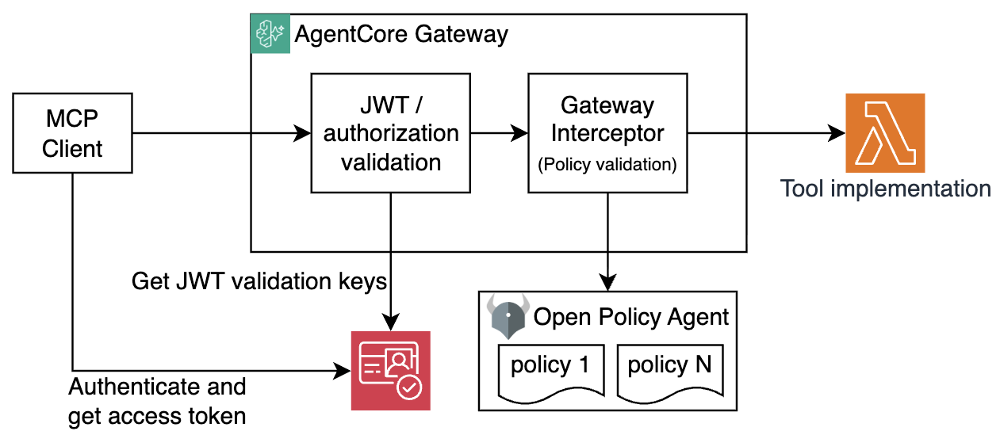

# AgentCore Gateway with Open Policy Agent

A sample project demonstrating how to integrate [Open Policy Agent (OPA)](https://www.openpolicyagent.org/) with an Amazon Bedrock AgentCore Gateway for custom policy enforcement. After JWT token validation, the gateway is forwarding request to an interceptor (a Lambda function). The interceptor decodes inbound JWTs, extracts token claims, MCP tool name and arguments, and forwards them to an OPA microservice running as another Lambda function. OPA evaluates [Rego](https://www.openpolicyagent.org/docs/latest/policy-language/) policies and returns authorization decisions before the request reaches the tool.

Other AgentCore Gateway projects:

- [Gateway Basics](https://github.com/aal80/agentcore-samples/tree/main/gateway-basics)
- [Gateway with inbound JWT](https://github.com/aal80/agentcore-samples/tree/main/gateway-with-inbound-jwt)
- [Gateway with interceptors](https://github.com/aal80/agentcore-samples/tree/main/gateway-with-interceptors)
- [Gateway with AgentCore Policy](https://github.com/aal80/agentcore-samples/tree/main/gateway-with-policies)

## Architecture



The project deploys:

- **AgentCore Gateway** — MCP-compatible gateway with `CUSTOM_JWT` authorizer and a Lambda request interceptor
- **gateway-interceptor** — Lambda function (Node.js 22) that decodes the inbound JWT, extracts claims, and calls OPA for an authorization decision before passing the request through
- **OPA service** — Open Policy Agent running as a Lambda container image with [Lambda Web Adapter](https://github.com/awslabs/aws-lambda-web-adapter), exposed via an API Gateway HTTP API
- **API Gateway HTTP API** — provides a stable HTTPS endpoint in front of the OPA Lambda
- **AWS Cognito** — User Pool with two app clients, each issued different OAuth scopes:
  - **client1** — `gateway/get_menu` scope only
  - **client2** — `gateway/get_menu` and `gateway/create_order` scopes
- **get-menu** — Lambda function (Node.js 22) that returns a pizza menu
- **create-order** — Lambda function (Node.js 22) that accepts a `pizzaId` and creates an order

## Policies

Policies are defined in [`opa/policy.rego`](./opa/policy.rego) using Rego:

- `allowed_to_get_menu` — permits the request if the JWT scope contains `gateway/get_menu`
- `allowed_to_create_orders` — permits the request if the JWT scope contains `gateway/create_order` **and** `pizzaId != 5` (no pineapple pizza allowed!)

## Prerequisites

- AWS CLI configured with appropriate credentials
- Terraform >= 1.0
- Docker for building the OPA container image
- `curl` and `jq` for testing

## Explore OPA policy

Explore [opa/policy.rego](./opa/policy.rego). Note that both `get_menu` and `create_orders` actions are denied by default. Note the conditions when these actions will be allowed - proper scope in place, and `pizza_id != 5` (we don't want pineapple pizza).

```rego
package pizzashop

# Deny by default
default allowed_to_get_menu = false
default allowed_to_create_orders = false

allowed_to_get_menu if {
    scopes := split(input.scope, " ")
    "gateway/get_menu" in scopes
}

allowed_to_create_orders if {
    scopes := split(input.scope, " ")
    "gateway/create_order" in scopes
    
    # NO PINEAPPLE PIZZA!
    input.mcpToolArguments.pizzaId != 5 
}
```

## Deploy

### 1. Build and push the OPA image

```bash
make login-to-ecr
make create-opa-ecr-repo
make build-opa-image
make push-opa-image
```

### 2. Deploy infrastructure

```bash
make deploy-infra
```

This provisions the gateway, Lambda functions, Cognito resources, OPA Lambda, and API Gateway.

## Authenticate and Test

### 1. No authentication yet

Run following command
```bash
make list-tools
```

As expected, you're getting back an error. You do not have access token yet. 

### 2. Authenticate as client1. 

Remember, client1 has `gateway/get_menu` scope only. 

Run the following commands:

```bash
make get-client1-token
```

Token is saved to `./tmp/access_token.txt` and used automatically by all test targets.

### 3. Retrieve list of tools

```bash
make list-tools
```

Success!

### 4. Get the pizza menu

```bash
make get-menu
```

Success!

### 5. Create an order

```bash
make create-order
```

Failure, as expected. **client1** can only get the menu — `create-order` will be denied:

```json
{
  "id": 1,
  "jsonrpc": "2.0",
  "error": {
    "code": -32090,
    "message": "Policy violation. Request rejected."
  }
}
```

### 6. Authenticate as client2

Remember, client2 has both `gateway/get_menu` and `gateway/create_order` scopes.

```bash
make get-client2-token
```

### 7. Try listing tools and getting menu as client2

```bash
make list-tools
make get-menu
```

Success!

### 8. Try creating an order as client2

```bash
make create-order
```

```json
{
  "jsonrpc": "2.0",
  "id": 1,
  "result": {
    "isError": false,
    "content": [
      {
        "type": "text",
        "text": 
          "{\"date\":\"2026-03-31T03:37:05.019Z\",
          \"item\":\"Margherita\",\"total\":12.99}"
      }
    ]
  }
}
```

### 9. Try creating orders for various pizza IDs

Test various pizzas until you get to id=5

```bash
make create-order pizzaId=1
make create-order pizzaId=2
make create-order pizzaId=3
make create-order pizzaId=4
make create-order pizzaId=5
```

Once you get to `pizzaId=5`, the policy kicks in:

```json
{
  "id": 1,
  "jsonrpc": "2.0",
  "error": {
    "code": -32090,
    "message": "Policy violation. Request rejected."
  }
}
```

## Cleanup

```bash
make destroy
```
