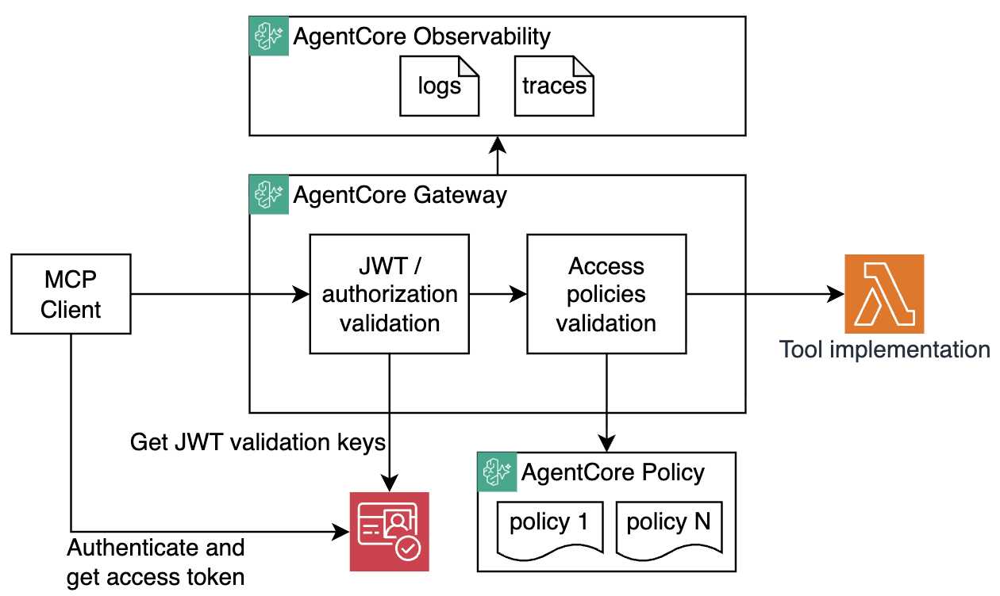

# AgentCore Gateway with Policies - Step-by-Step Tutorial

This tutorial demonstrates how to gradually enable security on an [Amazon Bedrock AgentCore Gateway](https://docs.aws.amazon.com/bedrock-agentcore/latest/devguide/gateway.html) using JWT authentication and [AgentCore Policy](https://docs.aws.amazon.com/bedrock-agentcore/latest/devguide/policy.html) Engine.



You'll build a secure pizza ordering MCP gateway with:

1. Two tools:
    - **get-menu** - Returns the pizza menu
    - **create-order** - Submits a pizza order (takes a `pizzaId` parameter, default is `pizzaId=1`)

2. Two OAuth clients with different scopes:
    - **client1** - can only get pizza menu (only has `gateway/get_menu` scope)
    - **client2** - can get pizza menu and create pizza orders (has both `gateway/get_menu` and `gateway/create_order` scopes)

3. A Policy Engine to enforce fine-grained authorization based on per-tool scope and payload validation. 

Explore [Makefile](./Makefile) for commands used in this tutorial. 

## Prerequisites

- AWS CLI configured with appropriate credentials
- Terraform
- `jq` and `make` 

## Walkthrough

### Step 1: Deploy the project

```bash
make deploy-all
```

This creates the gateway, Lambda functions implementing tools, Cognito resources, policy engine (not yet connected to the gateway), and observability (logs/traces). 

**At this point the project DOES NOT have any authorization controls enabled yet.** The gateway starts with `authorizer_type = "NONE"` and no policy engine attached (see [terraform/gateway.tf](./terraform/gateway.tf#L82-L107)).


### Step 2: Test initial state - no security, open access

The starting configuration is gateway has no authorization and no policy enforcement. Anyone can call any tool, no auth required. 

```bash
# List available tools
make list-tools

# Result: 
{
   "jsonrpc":"2.0",
   "id":1,
   "result":{
      "tools":[
         {
            "inputSchema":{... redacted ...},
            "name":"create-order___create-order",
            "description":"Use this tool to submit a new pizza order"
         },
         {
            "inputSchema":{ ... redacted ...},
            "name":"get-menu___get-menu",
            "description":"This tool returns pizza menu"
         }
      ]
   }
}
```

```bash
# Get the pizza menu
make get-menu

# Result:
{
   "jsonrpc":"2.0",
   "id":1,
   "result":{
      "isError":false,
      "content":[
         {
            "type":"text",
            "text":"{\"menu\":[
                {\"id\":1,\"name\":\"Margherita\",\"price\":12.99},
                {\"id\":2,\"name\":\"Pepperoni\",\"price\":14.99},
                ... redacted...]}"
         }
      ]
   }
}
```


```bash
# Create an order
make create-order

# Result:
{
   "jsonrpc":"2.0",
   "id":1,
   "result":{
      "isError":false,
      "content":[
         {
            "type":"text",
            "text":"{\"date\":\"2026-03-27T19:51:25.698Z\",
                     \"item\":\"Margherita\",
                     \"total\":12.99}"
         }
      ]
   }
}
```

All three calls succeed. 

Let's start adding security layers.

### Step 3: Enable JWT Authentication

In Step 1, Terraform created a Cognito user pool and two clients. See [terraform/cognito.tf](./terraform/cognito.tf#L26-L46) for details. Credentials for both clients were stored in `./tmp/cognito_client*.txt`.

To enable JWT Authorization on the AgentCore Gateway, update the gateway resource in [terraform/gateway.tf](terraform/gateway.tf#L87-L98):

1. Change `authorizer_type` from `"NONE"` to `"CUSTOM_JWT"`
2. Uncomment the `authorizer_configuration` block. Note the `allowed_scopes` property. It requires all incoming requests to have at a minimum `gateway/get_menu` scope. 
3. DO NOT uncomment `policy_engine_configuration` block yet. 

```hcl
resource "awscc_bedrockagentcore_gateway" "this" {
  # ...
  authorizer_type = "CUSTOM_JWT"

  authorizer_configuration = {
    custom_jwt_authorizer = {
      discovery_url   = local.cognito_discovery_url
      allowed_scopes = ["gateway/get_menu"]
      allowed_clients = [
        aws_cognito_user_pool_client.client1.id,
        aws_cognito_user_pool_client.client2.id,
      ]
    }
  }
  # ...
}
```

Deploy the updated configuration. Note that updating authorization configuration requires re-creating the AgentCore Gateway. 

```bash
make deploy-all-recreate-gateway
```

### Step 4: Test JWT validation

First, let's test without obtaining access tokens. 

```bash
make list-tools

# Result:
{
  "jsonrpc": "2.0",
  "id": 0,
  "error": {
    "code": -32001,
    "message": "Invalid Bearer token"
  }
}
```

As expected, MCP Requests are being rejected since now AgentCore Gateway expects to receive JWT in all requests. Let's get an access token and try again. 

```bash
# Call below commands one by one
make get-client1-token
make list-tools
make get-menu
make create-order
```

```bash
# Call below commands one by one
make get-client2-token
make list-tools
make get-menu
make create-order
```

All requests succeed!

If you decode the client1 token (e.g. using [jwt.io](https://jwt.io)), you'll see that client1 only has the `gateway/get_menu` scope.

```json
{
  "scope": "gateway/get_menu",
}
```

However at this point the gateway authorizer configuration only requires `gateway/get_menu` scope. Since both clients are allowed to receive this scope, both client1 and client2 are permitted to create orders. In other words, the gateway does not require `gateway/create_order` scope just yet - both clients can access all tools since there's no policy engine yet.

Let's summarize - so far both clients can call all tools, gateway authorized checks JWT validity and the presence of `gateway/get_menu` scope. But without there are no fine grained authorization policies just yet. Let's fix that. 

### Step 5: Enable Policy Engine (But no policies just yet!)

In [terraform/gateway.tf](terraform/gateway.tf#L103), uncomment the `policy_engine_configuration` block. This connects AgentCore Gateway to the Policy Engine. 

```hcl
resource "awscc_bedrockagentcore_gateway" "this" {
  # ...
  policy_engine_configuration = {
    arn  = awscc_bedrockagentcore_policy_engine.this.policy_engine_arn
    mode = "ENFORCE"
  }
  # ...
}
```

Explore [terraform/policy_engine.tf](./terraform/policy_engine.tf). Note that at the moment all policies are commented out. 

Deploy:

```bash
make deploy-all-recreate-gateway
```

Now test - **all calls will be denied** because AgentCore Policy Engine uses default-deny and there are no permit policies yet:

```bash
make get-client1-token
make list-tools    # => tools list is empty
make get-menu      # => Denied
make create-order  # => Denied

# List tools result:
{
  "jsonrpc": "2.0",
  "id": 1,
  "result": {
    "tools": []
  }
}

# Call tool result:
{
  "jsonrpc": "2.0",
  "id": 1,
  "error": {
    "code": -32002,
    "message": "Tool Execution Denied: Tool call not allowed due to policy enforcement 
                [No policy applies to the request (denied by default).]"
  }
}
```

### Step 6: Enable `permit_all` Policy. 

Let's illustrate how policies work. Start with a permit_all policy. 

In [terraform/policy_engine.tf](terraform/policy_engine.tf#L5-L15), uncomment the `permit_all` policy. Note that this policy permits ALL incoming requests and doesn't do any conditional validation. It is definitely overly permissive and we'll disable it in subsequent steps, but for now it helps to illustrate how policies work. 

```hcl
resource "awscc_bedrockagentcore_policy" "permit_all" {
  name             = "permit_all"
  policy_engine_id = awscc_bedrockagentcore_policy_engine.this.policy_engine_id
  validation_mode  = "IGNORE_ALL_FINDINGS"

  definition = {
    cedar = {
      statement = "permit(principal, action, resource is AgentCore::Gateway);"
    }
  }
}
```

Deploy (no need to recreate gateway anymore):

```bash
make deploy-all
```

Now BOTH authenticated clients can use all tools again:

```bash
make get-client1-token # try with client2 afterwards
make list-tools        # => Shows get-menu and create-order
make get-menu          # => Returns pizza menu
make create-order      # => Order created
```

### Step 7: Restrict to `get-menu` Only

You definitely don't want `permit_all` policy in production. This was for illustrative purposes only. Let's tighten the security. 

Let's remove the `permit_all` policy and add the `allow_get_menu` policy that only permits the `get-menu` tool. Note that this new policy allows ALL principals to invoke the `get_menu` tool in a specific AgentCore Gateway instance. 

In [terraform/policy_engine.tf](terraform/policy_engine.tf):
1. Comment out `permit_all`
2. Uncomment `allow_get_menu`

```hcl
resource "awscc_bedrockagentcore_policy" "allow_get_menu" {
  name             = "allow_get_menu"
  policy_engine_id = awscc_bedrockagentcore_policy_engine.this.policy_engine_id
  validation_mode  = "IGNORE_ALL_FINDINGS"

  definition = {
    cedar = {
      statement = <<-EOT
        permit(
          principal,
          action == AgentCore::Action::"get-menu___get-menu",
          resource == AgentCore::Gateway::"${awscc_bedrockagentcore_gateway.this.gateway_arn}"
        );
      EOT
    }
  }
}
```

Deploy:

```bash
make deploy-all
```

Test - both clients can get the menu, but neither can create orders, as expected:

```bash
make get-client1-token
make get-menu      # => Returns pizza menu
make create-order  # => Denied

make get-client2-token
make get-menu      # => Returns pizza menu
make create-order  # => Denied

# Create order result:
{
  "jsonrpc": "2.0",
  "id": 1,
  "error": {
    "code": -32002,
    "message": "Tool Execution Denied: Tool call not allowed due to policy enforcement 
                [No policy applies to the request (denied by default).]"
  }
}
```

### IMPORTANT

Reminder: 

* client1 only has access to `gateway/get_menu` scope
* client2 has access to `gateway/get_menu` and `gateway/create_order` scope

Keep this in mind for the next step. 

### Step 8: Allow `create-order` for clients with `gateway/create_order` scope

Let's add a policy that permits `create-order` only if the client has the `gateway/create_order` scope in their JWT.

In [terraform/policy_engine.tf](terraform/policy_engine.tf#L35), uncomment `allow_create_order_with_scope`. Note the "when" condition, it ensures that create_order tool can only be called if incoming request principal has `gateway/create_order` scope in the JWT. 

```hcl
resource "awscc_bedrockagentcore_policy" "allow_create_order_with_scope" {
  name             = "allow_create_order_with_scope"
  policy_engine_id = awscc_bedrockagentcore_policy_engine.this.policy_engine_id
  validation_mode  = "IGNORE_ALL_FINDINGS"

  definition = {
    cedar = {
      statement = <<-EOT
        permit(
          principal,
          action == AgentCore::Action::"create-order___create-order",
          resource == AgentCore::Gateway::"${awscc_bedrockagentcore_gateway.this.gateway_arn}"
        )
        when {
          principal.hasTag("scope") &&
          principal.getTag("scope") like "*gateway/create_order*"
        };
      EOT
    }
  }
}
```

Deploy:

```bash
make deploy-all
```

Test - as expected, client1 (missing scope) is denied, client2 (has scope) succeeds

```bash
# client1 only has gateway/get_menu scope
make get-client1-token
make get-menu      # => Returns pizza menu
make create-order  # => Denied (missing gateway/create_order scope)

# client2 has both gateway/get_menu and gateway/create_order scopes
make get-client2-token
make get-menu      # => Returns pizza menu
make create-order  # => Order created!
```

### Step 9: Forbid Pineapple Pizza

Get menu

```bash
make get-menu
```

Is that a PINEAPPLE PIZZA with id=5?! Let's see how a `forbid` policy can be used to block any orders of this abomination. 

Add a `forbid` policy that blocks ordering Pineapple pizza (id=5), regardless of any permit policies - `forbid` always wins over `permit`.

In [terraform/policy_engine.tf](terraform/policy_engine.tf#L57), uncomment `forbid_pineapple_pizza`. Note the `when` condition. 

```hcl
resource "awscc_bedrockagentcore_policy" "forbid_pineapple_pizza" {
  name             = "forbid_pineapple_pizza"
  policy_engine_id = awscc_bedrockagentcore_policy_engine.this.policy_engine_id
  validation_mode  = "IGNORE_ALL_FINDINGS"

  definition = {
    cedar = {
      statement = <<-EOT
        forbid (
          principal,
          action == AgentCore::Action::"create-order___create-order",
          resource == AgentCore::Gateway::"${awscc_bedrockagentcore_gateway.this.gateway_arn}"
        )
        when {
          context.input.pizzaId == 5
        };
      EOT
    }
  }
}
```

Deploy:

```bash
make deploy-all
```

Test - client2 can order any pizza except Pineapple:

```bash
make get-client2-token

# Test various pizzas until you get to id=5
make create-order pizzaId=1 
make create-order pizzaId=2 
make create-order pizzaId=3
make create-order pizzaId=4
make create-order pizzaId=5

# Result:
{
  "jsonrpc": "2.0",
  "id": 1,
  "error": {
    "code": -32002,
    "message": "Tool Execution Denied: Tool call not allowed due to policy enforcement 
                [Policy evaluation denied due to forbid_pineapple_pizza-fe7au4c2j9]"
  }
}

```

## Summary

| Step | Auth | Policy Engine | Policies | client1 | client2 |
|------|------|---------------|----------|---------|---------|
| 1-2 | None | Off | - | Full access | Full access |
| 3-4 | JWT | Off | - | Full access | Full access |
| 5 | JWT | Enabled | None | All denied | All denied |
| 6 | JWT | Enabled | permit_all | Full access | Full access |
| 7 | JWT | Enabled | allow_get_menu | Menu only | Menu only |
| 8 | JWT | Enabled | allow_get_menu + allow_create_order (scoped) | Menu only | Menu + Orders |
| 9 | JWT | Enabled | above + forbid_pineapple | Menu only | Menu + Orders (no Hawaiian) |

## Key Concepts

- **Default deny**: Without any permit policy, Policy Engine denies all requests
- **Forbid wins**: A `forbid` policy always overrides `permit` policies
- **Scope-based access**: JWT scopes from Cognito are available via `principal.getTag("scope")` in Policy Engine
- **Tool input validation**: Cedar can inspect tool arguments via `context.input.<field>` to enforce business rules
- **Action naming**: AgentCore uses the format `TargetName___ToolName` (triple underscore) for Cedar actions

## Useful Commands

```bash
make deploy-all                    # Deploy/update infrastructure
make deploy-all-recreate-gateway   # Recreate gateway (use when gateway auth config changes)
make destroy                       # Tear down everything

make get-client1-token             # Get OAuth token for client1
make get-client2-token             # Get OAuth token for client2

make list-tools                    # List available MCP tools
make get-menu                      # Call the get-menu tool
make create-order                  # Order pizza (default: pizzaId=1)
make create-order pizzaId=5        # Order a specific pizza by ID
```

## Cleanup

```bash
make destroy
```
