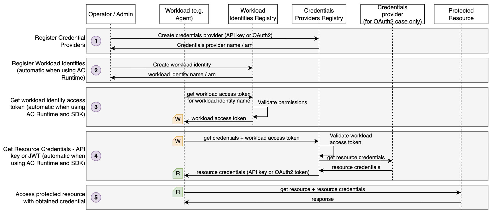
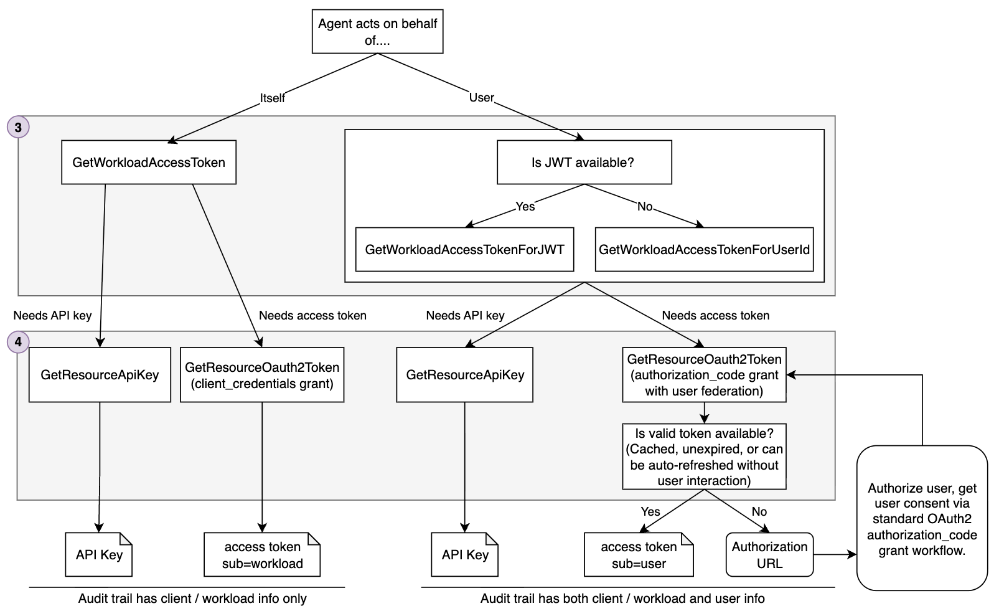
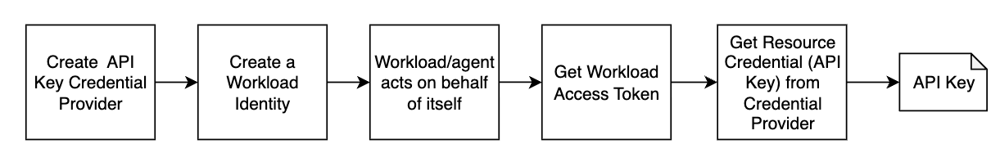

# AgentCore Identity Basics

This project demonstrates the core identity and credential management APIs in Amazon Bedrock AgentCore Identity. It shows how to create workload identities, acquire workload access tokens, store credentials in the AgentCore vault, and retrieve them securely at runtime — without hardcoding secrets in agent code.

Other AgentCore Identity projects
- [Machine-to-machine with JWT (client_credentials grant)](https://github.com/aal80/agentcore-samples/tree/main/identity-machine-to-machine-jwt)
- [User federation with JWT (authorization_code grant)](https://github.com/aal80/agentcore-samples/tree/main/identity-user-federation-with-jwt)

## Concepts

AgentCore Identity works in two layers:

**Control plane** (`bedrock-agentcore-control`) — set up once:
- **Credential Provider** — stores a credential (API key or OAuth2 config) in the AgentCore vault
- **Workload Identity** — represents the agent itself; acts as the principal for all credential lookups. Workload identities are created and managed automatically when running agents on AgentCore Runtime. They can also be managed via IaC, as shown in this project for educational purposes. 

**Data plane** (`bedrock-agentcore`) — called at runtime:
- **Workload Access Token** — proves who the agent is and optionally who it's acting on behalf of
- **GetResourceApiKey / GetResourceOauth2Token** — uses Workload Access Token to retrieve credentials from Credential Providers

## Diagrams

The following diagram illustrates a general workflow of using AgentCore Identity



* Step 1 - System operator or administrator registers Credential Providers (API key or OAuth2-based). This is done with IaC. 
* Step 2 - A workload identity is registered with AgentCore's identity registry. This step is fully automatic when deploying agents on AgentCore Runtime. However you can use it with any external agents as well, as illustrated in this project using IaC. 
* Step 3 - An agent retrieves workload identity access token. This is an opaque token that can only be retrieved by entiries with proper AWS IAM permissions. An agent can either
  * Retrieve workload identity access token representing the agent itself (no user involved)
  * Retrieve workload identity access token that contains user context, as will be described below. 
* Step 4 - The agent uses workload identity access token to request resource access credentials from the Credential Provider registered in Step 1. AgentCore validates that supplied workload identity has permissions to access requested Credentials Provider. Credential provider obtains resource credentials (e.g. API key or OAuth2 access token), stores it in its internal credentials vault and returns to the agent. At no point in time the agent has access to long-lived credentials like `client_id` or `client_secret`. 
* Step 5 - The agent uses obtained resource credential to access protected resources, for example an MCP Server. 

The exact workflow depends on several parameters, such as 

* Whether the agent will be accessing protected resource on behalf of itself or on behalf of the user
* Whetner the protected resource requires an API Key or OAuth2 token

The following diagram illustrates which AgentCore SDK methods (or CLI/API calls) should be used for various scenarios



If the agent is acting on behalf of
* Itself
  * Get workload identity using the `GetWorkloadAccessToken` method
  * If agent requires
    * An API Key - use `GetResourceApiKey` method
    * An OAuth2 token - use `GetResourceOauth2Token`. In this scenario, the Credentials Provider will use `client_credentials` grant internally to obtain access token. 
* A user
  * Get workload identity using either `GetWorkloadAccessTokenForJWT` (extracts UserId from JWT) or `GetWorkloadAccessTokenForUserId` (uses supplied UserId directly)
  * If agent requires
    * An API Key - use `GetResourceApiKey` method. The API Key credentials are NOT user specific, however the credential access audit record will contain user context. 
    * An OAuth2 token - use `GetResourceOauth2Token`. In this scenario, the Credentials Provider will first try to find existing user-specific access token. If refresh token is available, Credentials Provider will also attempt to refresh expired tokens. When Credentials Provider cannot obtain access token, it will trigger the OAuth2 `authorization_code` grant return and return authorization URL. Your agent needs to be able to handle this. 

## Running this sample project

This project illustrates a simple path using AgentCore Identity. For education purposes you'll trigger each step manually. When using AgentCore, many of these steps are either fully transparent (like Workload Identity creation) or simplified using the AgentCore SDK.



### Prerequisites

- AWS CLI configured with appropriate credentials
- [Terraform](https://developer.hashicorp.com/terraform/install) v1.14+
- make

### 1. Deploy infrastructure

This step provisions the Workload Identity and the API Key Credential Provider resources using Terraform. 

The API Key stored in the Credential Provider is hardcoded in `terraform/api-key-credential-provider.tf`:

```text
api_key = "abcd1234abcd1234"
```

Run Terraform to create all resources:

```bash
make deploy-infra
```

Terraform will output the generated resource names and write them to `./tmp/` for use in subsequent steps:

```text
Apply complete! Resources: 4 added, 0 changed, 0 destroyed.

Outputs:

credential_provider_name = "xxxx-identity-basics"
project_name = "xxxx-identity-basics"
workload_identity_name = "xxxx-identity-basics"
```

The names are written to:
- `./tmp/workload_identity_name.txt`
- `./tmp/credential_provider_name.txt`

### 2. Retrieve the workload access token

```bash
make get-workload-access-token
```

This reads the workload identity name from `./tmp/workload_identity_name.txt` and requests a signed access token:

```text
> WORKLOAD_IDENTITY_NAME=okxk-identity-basics
Getting workload access token...

Stored in ./tmp/workload_access_token.txt (preview: AgV4T5tSAY0N54CCnxe8...)
```

The token is stored in `./tmp/workload_access_token.txt`.

### 3. Retrieve the resource credentials from the credential provider

```bash
make get-resource-api-key
```

This reads the workload access token from `./tmp/workload_access_token.txt` and exchanges it for the API key stored in the Credential Provider:

```text
> WORKLOAD_ACCESS_TOKEN=AgV4T5tSAY0N54CCnxe8...REDACTED...
Getting API key for provider 'okxk-identity-basics'...

Result:
apiKey: abcd1234abcd1234
```

## Cleanup

```bash
make destroy
```

