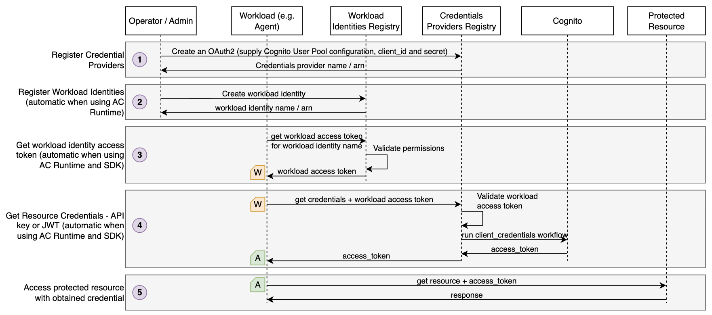
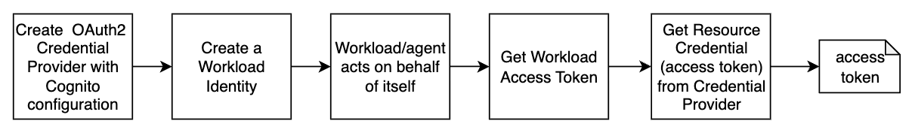

# AgentCore Identity - Machine to Machine (OAuth2 / Client Credentials)

When an AI agent needs to call a protected downstream service — such as an MCP server, an internal API, or a third-party tool — it needs to authenticate itself first. This project shows how an agent can securely obtain an OAuth2 access token representing itself, and use it to access protected resources — without ever handling long-lived secrets like client IDs or client secrets directly. Under-the-hood, this is done using the OAuth2 `client_credentials` flow with Amazon Cognito as the identity provider (you can use any OAuth2 provider of your choice), mediated by Amazon Bedrock AgentCore Identity.

This project is focusing on an OAuth2-based scenario where agent uses machine-to-machine authentication (client_credentials grant) to retrieve an access token representing the agent itself. For a more generic overview of AgentCore Identity see [this repo](https://github.com/aal80/agentcore-samples/tree/main/identity-basics).

## Understanding AgentCore Identity

AgentCore Identity works in two layers:

**Control plane** (`bedrock-agentcore-control`):
- **OAuth2 Credential Provider** — stores OAuth2 provider configuration (client ID, client secret, Cognito endpoints) in the AgentCore vault
- **Workload Identity** — represents the agent itself; acts as the principal for all credential lookups. Workload identities are created and managed automatically when running agents on AgentCore Runtime. They can also be managed manually, as shown in this project for educational purposes.

**Data plane** (`bedrock-agentcore`) — called at runtime:
- **Workload Access Token** — proves who the agent is
- **GetResourceOauth2Token** — uses the Workload Access Token to retrieve an OAuth2 access token from the credential provider using the `client_credentials` grant

## Diagrams

The following diagram illustrates a general workflow of using AgentCore Identity for this scenario



* Step 1 - System operator or administrator registers a Credential Provider with Cognito User Pool configuration. The operation also supplies `client_id` and `client_secret`.
* Step 2 - A workload identity is registered with AgentCore's identity registry. This step is fully automatic when deploying agents on AgentCore Runtime. However you can use it with any external agents as well, as illustrated in this project.
* Step 3 - An agent retrieves a workload identity access token. This is an opaque token that can only be retrieved by entities with proper AWS IAM permissions. In this project the agent retrieves a token representing itself (no user context).
* Step 4 - The agent uses workload identity access token to request resource access credentials from the Credential Provider registered in Step 1. AgentCore validates that supplied workload identity has permissions to access requested Credentials Provider. Credential provider obtains resource credentials from Cognito using the `client_credentials` grant, stores it in its internal credentials vault and returns to the agent. At no point in time the agent has access to long-lived credentials like `client_id` or `client_secret`.
* Step 5 - The agent uses obtained resource credential to access protected resources, for example an MCP Server.

## Running this sample project

To understand how an agent authenticates itself and retrieves credentials at runtime, this project walks you through each step manually — from provisioning the Cognito identity provider to calling the protected resource. In a production AgentCore deployment many of these steps happen automatically or through the SDK, but doing them explicitly here makes the mechanics visible.



### Prerequisites

- AWS CLI configured with appropriate credentials
- Terraform
- make

### 1. Deploy infrastructure

This project uses Amazon Cognito as the OAuth2 identity provider. The Terraform configuration in `terraform/` creates:
- A Cognito User Pool and hosted domain
- A resource server (`backend`) with `read` and `write` scopes
- An app client configured for `client_credentials` flow

```bash
make deploy-infra
```

Terraform writes the Cognito endpoints and client credentials to `./tmp/` for use in subsequent steps.

### 2. Create an OAuth2 Credential Provider

```bash
make create-oauth2-credential-provider
```

Validate that the Credential Provider was successfully created:

```bash
make get-oauth2-credential-provider
```

```yaml
name: test-oauth2-provider
credentialProviderVendor: CognitoOauth2
credentialProviderArn: arn:aws:bedrock-agentcore:us-east-1:281024298475:token-vault/default/oauth2credentialprovider/test-oauth2-provider
createdTime: '2026-04-02T18:58:34.318000-05:00'
lastUpdatedTime: '2026-04-02T18:58:34.318000-05:00'
clientSecretArn:
  secretArn: arn:aws:secretsmanager:us-east-1:...REDACTED...

callbackUrl: https://bedrock-agentcore.us-east-1.amazonaws.com/identities/oauth2/callback/...REDACTED
oauth2ProviderConfigOutput:
  includedOauth2ProviderConfig:
    clientId: 58u1g4ac3jd123123i5eenpoke
    oauthDiscovery:
      authorizationServerMetadata:
        authorizationEndpoint: https://pkja-identity-basics.auth.us-east-1.amazoncognito.com/oauth2/authorize
        issuer: https://cognito-idp.us-east-1.amazonaws.com/us-east-1_RZb7A6NDA
        responseTypes:
        - code
        tokenEndpoint: https://pkja-identity-basics.auth.us-east-1.amazoncognito.com/oauth2/token
...redacted...
```

> **Note:** `responseTypes: - code` in the response is metadata sourced from Cognito's OIDC discovery document and reflects server-level capabilities. It does not affect the grant type used. AgentCore will use the `client_credentials` grant because both `clientId` and `clientSecret` are present in the provider config and `--oauth2-flow M2M` is specified at token request time.

### 3. Create a Workload Identity

```bash
make create-workload-identity
```

Validate that the Workload Identity was successfully created:

```bash
make get-workload-identity
```

```yaml
name: test-identity
workloadIdentityArn: arn:aws:bedrock-agentcore:us-east-1:123123123:workload-identity-directory/default/workload-identity/test-identity
createdTime: '2026-04-02T16:22:21.318000-05:00'
lastUpdatedTime: '2026-04-02T16:22:21.318000-05:00'
allowedResourceOauth2ReturnUrls: []
```

### 4. Retrieve the workload access token

```bash
make get-workload-access-token
```

```text
Getting workload access token for machine2machine...

Stored in ./tmp/workload_access_token.txt (preview: AgV4T5tSAY0N54CCnxe8...)
```

The workload access token was successfully retrieved and stored in `./tmp/workload_access_token.txt`.

### 5. Retrieve an OAuth2 token from the credential provider

```bash
make get-resource-oauth2-token
```

This command reads the workload token retrieved in step 4 and uses it to request an OAuth2 access token from the Cognito credential provider. AgentCore calls Cognito's token endpoint with `grant_type=client_credentials` and the configured scopes (`backend/read backend/write`).

Decoded access token payload:

```json
{
  "sub": "58u1g4ac3jdl24f58i5eenpoke",
  "token_use": "access",
  "scope": "backend/write backend/read",
  "auth_time": 1775174540,
  "iss": "https://cognito-idp.us-east-1.amazonaws.com/us-east-1_RZb7A6NDA",
  "exp": 1775178140,
  "iat": 1775174540,
  "version": 2,
  "jti": "16f7732e-6ca0-470b-952a-7fb11672ff64",
  "client_id": "58u1g4ac3jdl24f58i5eenpoke"
}
```

The scopes requested default to `backend/read backend/write` as defined in `Makefile`. 

## Cleanup

```bash
make delete-workload-identity
make delete-oauth2-credential-provider
make destroy
```
