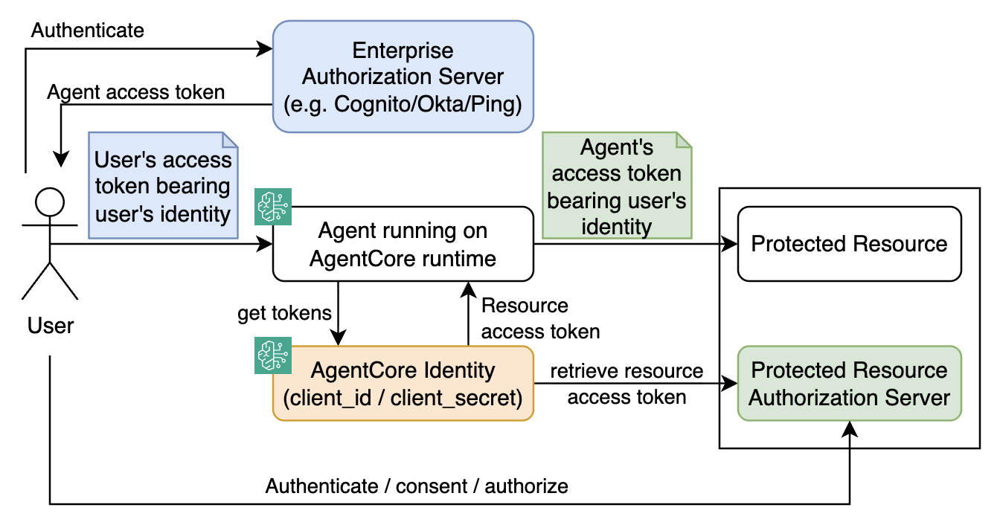

# AgentCore Identity - User Federation with JWT (OAuth2 / Authorization Code)

When an AI agent acts on behalf of a human user — for example, accessing a user's calendar, reading their emails, or calling a service using their identity — the agent needs to obtain an OAuth2 access token that represents that user, not just itself. This project shows how an agent can securely initiate and complete a user authentication flow using the OAuth2 `authorization_code` grant, mediated by Amazon Bedrock AgentCore Identity.



Unlike the [machine-to-machine (`client_credentials`) flow](https://github.com/aal80/agentcore-samples/tree/main/identity-machine-to-machine-jwt), this scenario involves a real user: the agent redirects the user to Cognito's login page, the user authenticates, and AgentCore exchanges the resulting authorization code for an access token on the agent's behalf — without the agent EVER handling the user's credentials or long-lived OAuth2 client secrets.

This project focuses on the `USER_FEDERATION` flow using Amazon Cognito as the identity provider (you can use any OAuth2-compliant provider). For a more generic overview of AgentCore Identity see [this repo](https://github.com/aal80/agentcore-samples/tree/main/identity-basics). For the machine-to-machine variant see the [identity-m2m](https://github.com/aal80/agentcore-samples/tree/main/identity-machine-to-machine-jwt) project.

## Understanding AgentCore Identity

AgentCore Identity works in two layers:

**Control plane** (`bedrock-agentcore-control`):
- **OAuth2 Credential Provider** — stores OAuth2 provider configuration (client ID, client secret, Cognito endpoints) in the AgentCore vault. Also exposes a `callbackUrl` that Cognito must be configured to redirect to after user login.
- **Workload Identity** — represents the agent itself; acts as the principal for all credential lookups. Workload identities are created and managed automatically when running agents on AgentCore Runtime. but can also be managed with IaC, as shown in this project for educational purposes.

**Data plane** (`bedrock-agentcore`) — called at runtime:
- **Workload Access Token (for user)** — an opaque token that binds a specific user identity to the agent's workload context. Obtained via `get-workload-access-token-for-user-id`.
- **StartResourceOauth2TokenWorkflow** — initiates the `USER_FEDERATION` flow; returns an `authorizationUrl` (redirect the user here) and a `sessionUri` (used to resume the session after login).
- **CompleteResourceTokenAuth** — called after the user completes browser authentication; signals AgentCore to exchange the authorization code for an access token.
- **GetResourceOauth2Token** — called after authentication is complete; returns the actual OAuth2 access token for the user.

## Diagrams

The following diagram illustrates the general workflow for this scenario:


1. System operator registers an OAuth2 Credential Provider with Cognito configuration (client ID, client secret, endpoints). AgentCore returns a `callbackUrl` that is registered as a redirect URI in Cognito. 
2. A workload identity is registered with AgentCore's identity registry. 
3. End-user sends a request to the agent asking it to perform an action on a target resource. The agent obtains a workload access token scoped to that specific user (`get-workload-access-token-for-user-id`). This token binds the user context to the agent's workload identity token.
4. Agents initiates a workflow to obtain the resource access token:

    a. The agent calls `get-resource-oauth2-token` with `USER_FEDERATION` flow. In case AgentCore Identity is able to return resource access token immediately - it does so, for example when an existing cached token is available or it can use a previously obtained refresh token to get a new access token. If not, AgentCore returns an `authorizationUrl` and a `sessionUri`. The workload stores sessionUri bound to the user context. 

    b. The user's browser is redirected to AgentCore's `authorizationUrl`, which further redirects the browser to the `authorizationUrl` provided by the authorization server for logging in. After successful authentication, the user's browser is redirected back to the AgentCore's `callbackUrl`, which redirects user's browser back to the agent/workload `callbackUrl`. 
    
    c. The agent validates that the returning user session matches the `sessionUri` stored previously. This ensures authentication session cannot be hijacked. After successful validation, the agent calls `complete-resource-token-auth` to signal completion. AgentCore Identity exchanges the authorization code for an access token granting access to the resource server.

    d. The agent calls `get-resource-oauth2-token` again - this time AgentCore returns the actual OAuth2 access token representing the authenticated user and granting access to the protected resource server. 

## Running this sample project

This project walks through each step manually — from provisioning infrastructure to retrieving a user-scoped access token. In production many of these steps happen automatically or through the SDK, but showing them explicitly here makes the mechanics visible.


### Prerequisites

- AWS CLI configured with appropriate credentials
- Terraform
- make

### 1. Deploy all infrastructure

A single Terraform apply provisions required resources:
- A Cognito User Pool, hosted domain, resource server (`backend`) with `read`/`write` scopes, and an app client configured for the `authorization_code` flow
- A test user (`alice@example.com`)
- An AgentCore OAuth2 Credential Provider pointing to Cognito (client ID, client secret, discovery URL)
- The AgentCore `callbackUrl` automatically registered back into the Cognito app client
- A Workload Identity representing the agent

```bash
make deploy-infra
```

Terraform writes the names and credentials needed by subsequent steps to `./tmp/`.

> **Note:** Terraform handles the callback URL bootstrapping automatically. The OAuth2 Credential Provider is created first; a `null_resource` then fetches its `callbackUrl` via the AWS CLI and registers it with the Cognito app client in the same apply.

### 2. Retrieve a user-scoped workload access token

```bash
make get-workload-access-token-for-user-id
```

```text
Getting workload access token for user federation...

Stored in ./tmp/workload_access_token.txt (preview: AgV4T5tSAY0N54CCnxe8...)
```

This token is an opaque string that binds the user identity (`alice@example.com`) to the agent's workload context. It is only resolvable by AgentCore and cannot be decoded as a JWT.

### 3. Start the OAuth2 user authentication workflow

```bash
make start-resource-oauth2-token-workflow
```

AgentCore initiates the `USER_FEDERATION` flow and returns:
- `authorizationUrl` — redirect the user here to authenticate
- `sessionUri` — used to resume the session after login

```text
authorizationUrl stored in ./tmp/authorization_url.txt
https://xxxx-identity-user-federation-with-jwt.auth.us-east-1.amazoncognito.com/oauth2/authorize?...

sessionUri stored in ./tmp/authorization_session_uri.txt
urn:ietf:params:oauth:...
```

Open the `authorizationUrl` in a browser and log in with:
- **Username**: `alice@example.com`
- **Password**: `qweQWE123!@#`

After login, Cognito redirects the browser to AgentCore's callback URL, which should look like `http://localhost/?session_id=urn%3Aietf%3Aparams%3Aoauth%3Arequest_uri%3AMzc3YjQyMzAtZDM3MS00NGIyLTgyYzUtNmU1MmMzNDFlNDYy`.

The browser will show an empty or error page — this is expected, you can close the browser window.

### 4. Complete the authentication flow

```bash
make complete-resource-token-auth
```

This signals AgentCore to exchange the authorization code for tokens. The `sessionUri` saved in the previous step is passed to match the previously initiated authentication session.

### 5. Retrieve the user access token

```bash
make get-resource-access-token-after-authentication
```

AgentCore returns the OAuth2 access token representing `alice@example.com`. The agent can now use this token to access protected resources on the user's behalf.

```json
{
  "sub": "84d8c4b8-9061-70bd-e684-dd8fabdbca2e",
  "username": "alice@example.com",
  "scope": "backend/write backend/read",
  "iss": "https://cognito-idp.us-east-1.amazonaws.com/us-east-1_15HN8eAoH",
  "client_id": "5bar9bb4sjbjhjjmfskauponan",
  "origin_jti": "a2f48896-f0fb-478b-89da-e5ae564ae554",
  "event_id": "866a7610-a61c-411f-b869-bbba69442787",
  "token_use": "access",
  "auth_time": 1775501498,
  "exp": 1775505098,
  "iat": 1775501498,
  "jti": "15bb9f33-3038-416b-9d3a-a934c736569f",
  "version": 2
}
```

## Cleanup

```bash
make destroy
```
