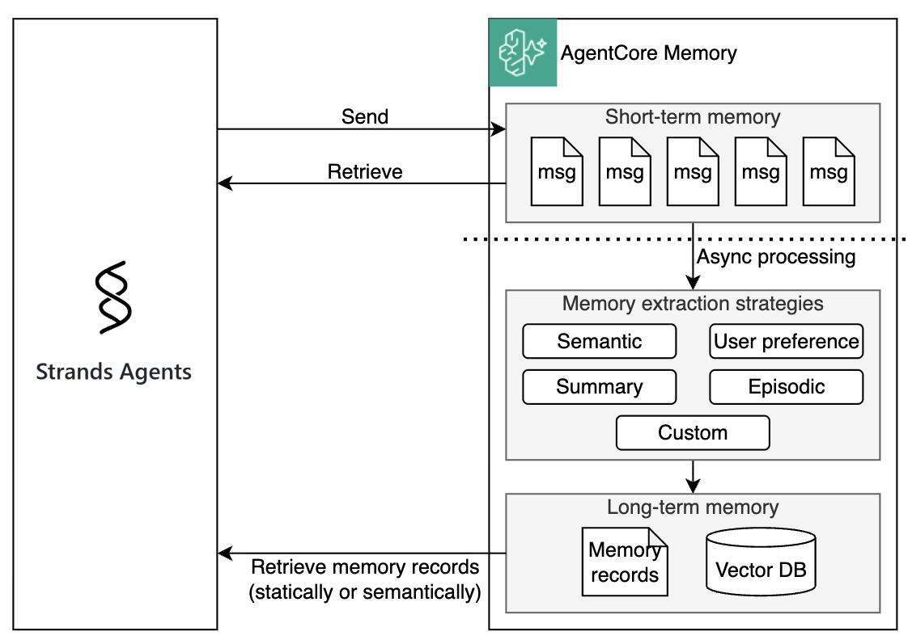

# Strands Agent with AgentCore Memory

A sample project that demonstrates how to build a [Strands Agents](https://github.com/strands-agents/sdk-python) agent with [Amazon Bedrock AgentCore](https://docs.aws.amazon.com/bedrock-agentcore/) Memory integration. The agent remembers user preferences across sessions using AgentCore's memory service.

## How It Works

1. **First invocation** - The user chats with the agent and tells it about their food preferences. The agent emits this message exchange to AgentCore Memory, where user preferences are extracted and stored for future use. 
2. **Memory processing** - AgentCore's `USER_PREFERENCE` memory strategy extracts and persists the preference into the `/preferences/{actorId}` namespace.
3. **Second invocation** - A new session (no `session_id`) asks about food preferences. The agent retrieves stored memories via `AgentCoreMemorySessionManager` and responds with context from the first conversation.

## Example

#### First conversation

```
User: I'd like to order a large pepperoni pizza for delivery.
Agent: Sure! Any preferences for the cheese or crust? We have regular, thin, and stuffed crust, and we offer both dairy and vegan cheese options.

User: Vegan cheese please - I'm lactose intolerant. And make it thin crust. Oh, and add some jalapeños on top.
Agent: Got it! One large thin-crust pepperoni pizza with vegan cheese and jalapeños. What's your delivery address?

User: 123 Main Street, Apt 4B. And no onions anywhere near it - I'm allergic.
Agent: Order confirmed! Large thin-crust pepperoni pizza with vegan cheese and jalapeños, no onions, delivering to 123 Main Street, Apt 4B. Estimated delivery in 30-35 minutes.
```

#### Extracted user preferences

As a result of the above exchange, the following user preferences are retrieved and stored in AgentCore Memory under `/preferences/{user_name}` namespace

1. User is lactose intolerant and requires vegan cheese on all pizza orders
2. User prefers thin crust pizza
3. User has an onion allergy - never include onions
4. User enjoys spicy toppings such as jalapeños
5. User's preferred pizza topping is pepperoni

These are extracted by the USER_PREFERENCE memory strategy asynchronously after the conversation ends.

Whenever user uses the agent to order pizza again, the agent retrieves the above preferences automatically and can immediately suggest a thin-crust pepperoni pizza with vegan cheese and jalapeños, no onions - without the user repeating themselves.

## Architecture



- **Agent** - A containerized Strands agent running on AgentCore
- **Memory** - AgentCore Memory with a `USER_PREFERENCE` strategy, configured via Terraform
- **Infrastructure** - Terraform provisions the AgentCore Runtime, Memory, IAM roles, and ECR repository reference

## Prerequisites

- Python 3.13+
- [uv](https://docs.astral.sh/uv/) (package manager)
- Docker to build/push containers
- AWS CLI configured with appropriate credentials
- Terraform

## Project Structure

```
.
├── main.py                  # Agent entrypoint with memory integration
├── Makefile                 # Build, deploy, and invoke commands
├── Dockerfile               # Container image definition (ARM64)
├── pyproject.toml           # Python dependencies
├── terraform/
│   ├── providers.tf         # AWS/AWSCC providers and shared locals
│   ├── ecr.tf               # ECR repository data source
│   ├── agentcore_runtime.tf # AgentCore Runtime + IAM role
│   └── agentcore_memory.tf  # AgentCore Memory + strategy + IAM role
└── test-data/
    ├── invoke-agent-payload1.json  # Tells agent about food preferences
    └── invoke-agent-payload2.json  # Asks agent to recall preferences
```

## Deploy

### 1. Create the ECR repository and push the container image

```bash
make create-ecr-repo
make login-to-ecr
make build-image
make push-image
```

### 2. Deploy infrastructure with Terraform

```bash
make deploy-infra
```

Or do it all at once:

```bash
make deploy-all
```

## Invoke the Agent

### Step 1 - Tell the agent about your preferences

```bash
make invoke1
```

This sends:
```json
{"prompt": "I really really like pepperoni pizza, especially when it comes with hot tomato sauce. Im lactose intollerant, so I always get vegan cheese only."}
```

### Step 2 - Wait for memory processing

It takes a few minutes for the memory strategy to extract and store user preferences. Check with:

```bash
make list-memory-records
```

After a few minutes you should see extracted memory records returned from the service. 

### Step 3 - Ask the agent to recall your preferences (new session)

```bash
make invoke2
```

This sends (without a `session_id`, so it runs on a fresh runtime instance):
```json
{"prompt": "Tell me about my food preferences"}
```

The agent uses AgentCore Memory to retrieve the stored preferences and responds with context from the first conversation.

## Cleanup

```bash
make destroy
```
